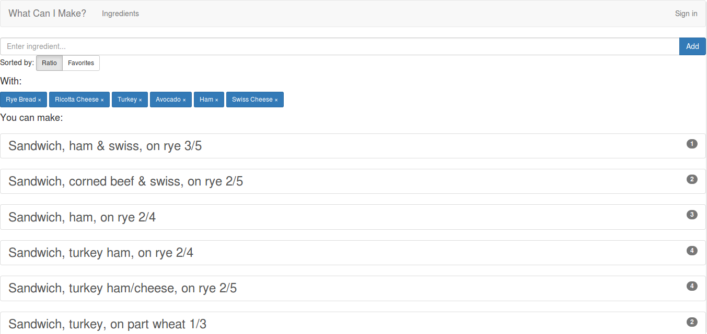
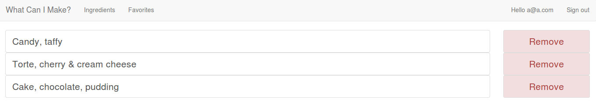
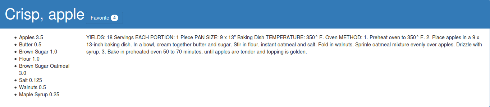

# What Can I Make?
[chaseengel.me/wcim](https://chaseengel.me/wcim)
#### Description:
WCIM is a simple implementation of a ingredient-based recipe finder.
This means that users are allowed to search for recipes using ingredients they have available.
WCIM will try to find a recipe that contains all or close to all of the ingredients inputted by a user.

In addition to searching, users are able to favorite specific recipes.

A favourited recipe is added to the user's Favorites page.

Every recipe displays the required ingredients and quantity. Instructions are provided detailing the cooking procedure.

#### Technologies Used:
* Ruby On Rails
* Devise
* JQuery
* Bootstrap
